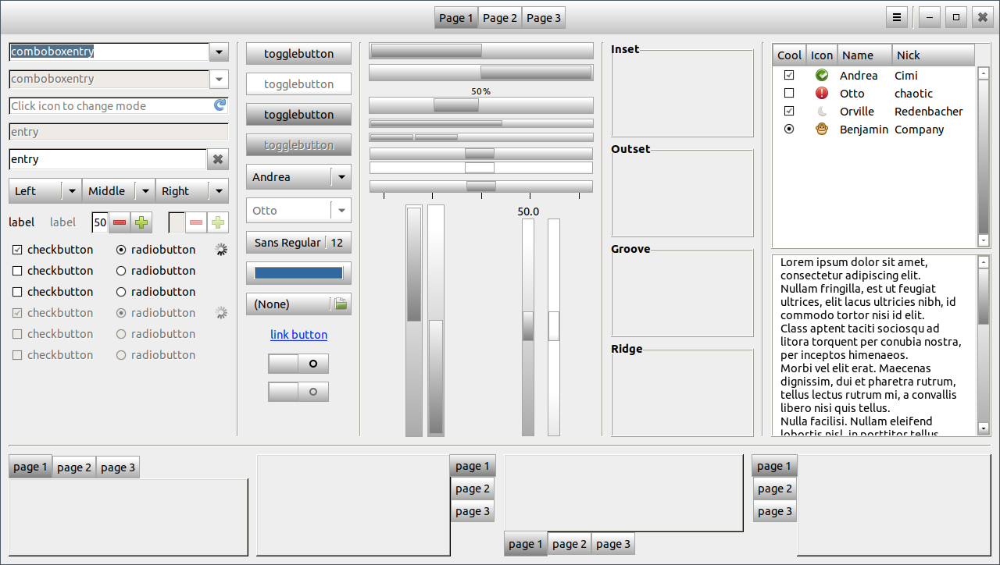

Flat-grey-rounded GTK Theme
===========================

This is the fork of the [Raleigh Reloaded](https://github.com/vlastavesely/raleigh-reloaded) theme, modified to look like the traditional [Flat-grey-rounded Puppy Linux GTK 2 theme](https://distro.ibiblio.org/puppylinux/pet_packages-noarch/gtk_theme_flat_grey_rounded-1.pet).

Using Raleigh Reloaded as a base made the GTK 3 porting effort easier, since the GTK 2 theme is very close to Raleigh, the default GTK 2 theme.

Preview
-------

Notes on Compatibility
----------------------
* The theme does support `GTK-2.0` and `GTK-3.20` but not the older `GTK-3.*` versions.
* The same widgets are rendered in different ways in `GTK-2.0` and `GTK-3.0`. Therefore, it is not possible to tune all the `GTK-3.0` elements to be absolutely the same like corresponding elements from `GTK-2.0`.
* Some programs require additional hacks that cannot be integrated into the main stylesheet. In those cases, the user must use a program-specific stylesheet, if the program supports it. For more information about some known cases, see the [doc](doc) directory.

Licensing Notice
----------------
This software is released under the terms of the GPL license version 2 as published by the Free Software Foundation. You can freely redistribute and/or modify the software under the terms of the license.

This program is distributed in the hope that it will be useful, but WITHOUT ANY WARRANTY; without even the implied warranty of MERCHANTABILITY or FITNESS FOR A PARTICULAR PURPOSE. See the GNU General Public License for more details.

For more information on details of the license, see the file [LICENSE.md](LICENSE.md).
